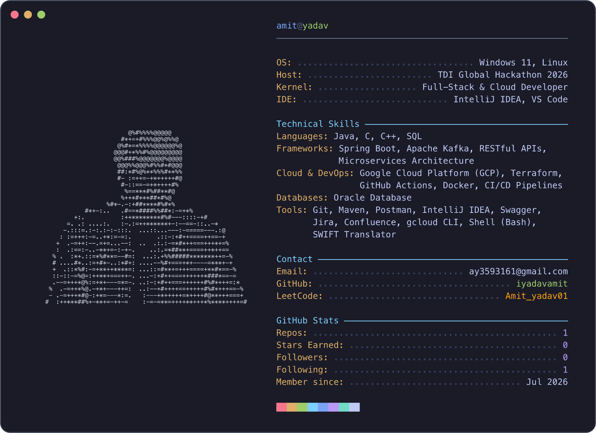

<!--
  ┌─────────────────────────────────────────────────────────────────────┐
  │  This profile card is the SVG in dark_mode.svg (neofetch-style).     │
  │                                                                     │
  │  To customise the details (name, OS, Host, Languages, Hobbies,      │
  │  Contact, Stats, colours) just edit the CONFIG values near the top  │
  │  of generate.py and re-run:                                         │
  │                                                                     │
  │      python3 generate.py                                            │
  │                                                                     │
  │  It rewrites dark_mode.svg. The ASCII portrait lives in             │
  │  portrait.txt — swap it for your own art any time.                  │
  └─────────────────────────────────────────────────────────────────────┘
-->

  

  
  

<!-- profile card • updated via API -->
